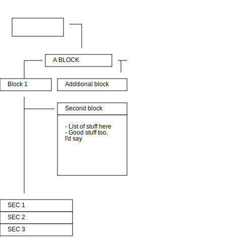

# asc2svg

Makes this:

```
    +----------------+
    |                |<----+
    |                |     |
    +----------------+     |
                           |
                           |
               +-----------+---------+
        +----->|     unexpected      |<-+
        |      +---------------------+  |
        |                               v
+-------+--------+ +----------------------+
|    Block 1     | |   Additional block   |
+-------+--------+ +----------+-----------+
        |                     v
        |          +----------------------+
        +--------->|     Second block     |
        |          +----------------------+
        |          |                      |
        |          | - List of stuff here |
        |          | - Good stuff too,    |
        |          |   I'd say            |
        |          |                      |
        |          |                      |
        |          |                      |
        |          |                      |
        |          |                      |
        |          +----------------------+
        |
        |
        v
+-----------------------+
|         SEC 1         |
+-----------------------+
|         SEC 2         |
+-----------------------+
|         SEC 3         |
+-----------------------+
```

into this:


